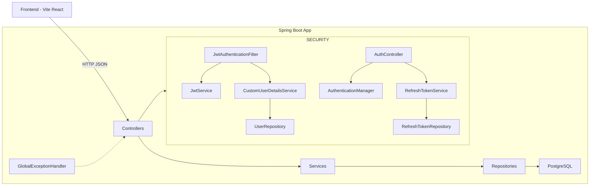

%% ========= DOMAINS (HTTP -> Service -> Repo) =========
subgraph DOMAINS[Domínios]
TRIP_C[TripController] --> TRIP_S[TripService]
TRIP_C --> SUM_S[TripSummaryService]
TRIP_S --> TRIP_R[TripRepository]
SUM_S --> TRIP_R

    DEST_C[DestinationController] --> DEST_S[DestinationService]
    DEST_S --> DEST_R[DestinationRepository]

    IT_C[ItineraryDayController] --> IT_S[ItineraryDayService]
    IT_S --> IT_R[ItineraryDayRepository]

    ACT_C[ActivityController] --> ACT_S[ActivityService]
    ACT_S --> ACT_R[ActivityRepository]
    ACT_S --> IT_R

    EXP_C[ExpenseController] --> EXP_S[ExpenseService]
    EXP_S --> EXP_R[ExpenseRepository]

    BUD_C[BudgetController] --> BUD_S[BudgetService]
    BUD_S --> BUD_R[BudgetRepository]
    BUD_S --> TRIP_R
end

C --- TRIP_C
C --- DEST_C
C --- IT_C
C --- ACT_C
C --- EXP_C
C --- BUD_C

%% ========= DATA MODEL =========
subgraph MODEL[Modelo de Dados (JPA Entities)]
USER[User]
TRIP[Trip]
DEST[Destination]
DAY[ItineraryDay]
ACT[Activity]
EXP[Expense]
BUD[Budget]
RT[RefreshToken]

    USER -->|1:N owner| TRIP
    TRIP -->|N:1| DEST
    TRIP -->|1:N| DAY
    DAY -->|1:N| ACT
    TRIP -->|1:N| EXP
    TRIP -->|1:1 unique| BUD
    USER -->|1:N| RT
end

%% ========= REPO -> MODEL -> DB =========
USER_REPO --> USER --> DB
RT_REPO --> RT --> DB
TRIP_R --> TRIP --> DB
DEST_R --> DEST --> DB
IT_R --> DAY --> DB
ACT_R --> ACT --> DB
EXP_R --> EXP --> DB
BUD_R --> BUD --> DB
