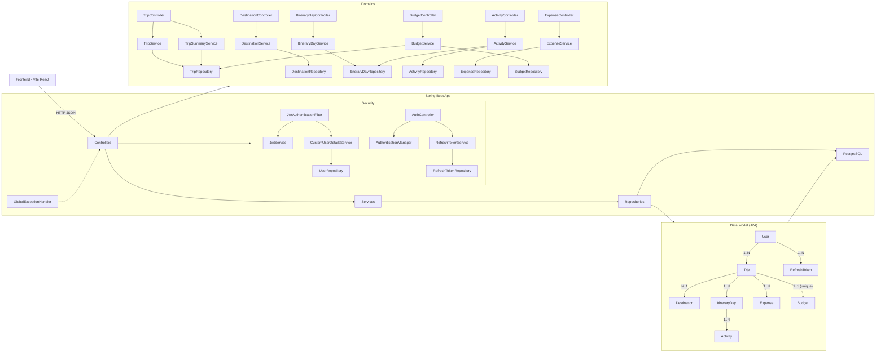

```mermaid
flowchart LR

%% ========= FRONT -> BACK =========
FE["Frontend - Vite React"] -->|"HTTP JSON"| CTRL["Controllers"]

%% ========= APP CORE =========
subgraph APP["Spring Boot App"]
CTRL --> SVC["Services"]
SVC --> REPO["Repositories"]
REPO --> DB["PostgreSQL"]

EX["GlobalExceptionHandler"] -.-> CTRL

%% ========= SECURITY =========
subgraph SECURITY["Security"]
JWTF["JwtAuthenticationFilter"] --> JWTS["JwtService"]
JWTF --> UDS["CustomUserDetailsService"]
UDS --> USERREPO["UserRepository"]

AUTHC["AuthController"] --> AUTHM["AuthenticationManager"]
AUTHC --> RTS["RefreshTokenService"]
RTS --> RTREPO["RefreshTokenRepository"]
end

CTRL --> SECURITY
end

%% ========= DOMAINS (HTTP -> Service -> Repo) =========
subgraph DOMAINS["Domains"]
TRIP_C["TripController"] --> TRIP_S["TripService"] --> TRIP_R["TripRepository"]
TRIP_C --> SUM_S["TripSummaryService"] --> TRIP_R

DEST_C["DestinationController"] --> DEST_S["DestinationService"] --> DEST_R["DestinationRepository"]

IT_C["ItineraryDayController"] --> IT_S["ItineraryDayService"] --> IT_R["ItineraryDayRepository"]

ACT_C["ActivityController"] --> ACT_S["ActivityService"] --> ACT_R["ActivityRepository"]
ACT_S --> IT_R

EXP_C["ExpenseController"] --> EXP_S["ExpenseService"] --> EXP_R["ExpenseRepository"]

BUD_C["BudgetController"] --> BUD_S["BudgetService"] --> BUD_R["BudgetRepository"]
BUD_S --> TRIP_R
end

CTRL --> DOMAINS

%% ========= DATA MODEL =========
subgraph MODEL["Data Model (JPA)"]
USER["User"]
TRIP["Trip"]
DEST["Destination"]
DAY["ItineraryDay"]
ACT["Activity"]
EXP["Expense"]
BUD["Budget"]
RT["RefreshToken"]

USER -->|"1..N"| TRIP
TRIP -->|"N..1"| DEST
TRIP -->|"1..N"| DAY
DAY -->|"1..N"| ACT
TRIP -->|"1..N"| EXP
TRIP -->|"1..1 (unique)"| BUD
USER -->|"1..N"| RT
end

REPO --> MODEL
MODEL --> DB
```
